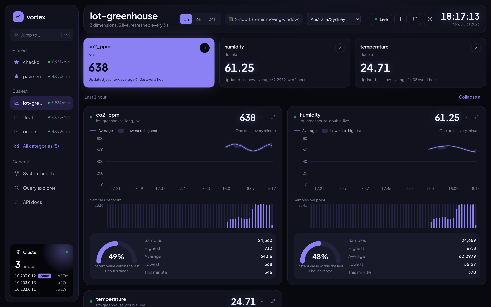
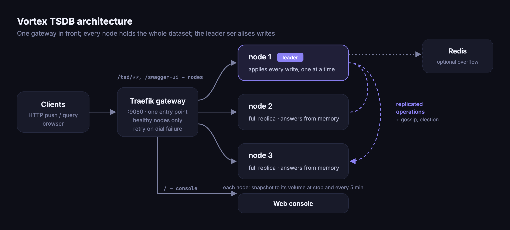
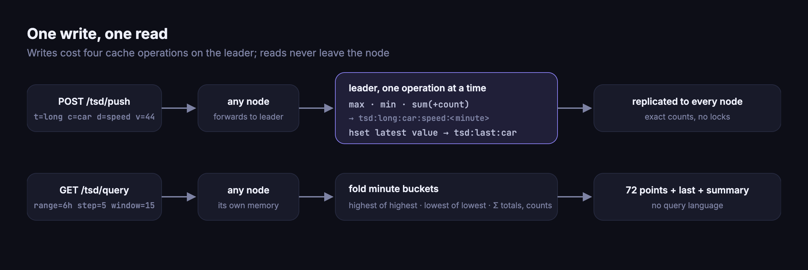
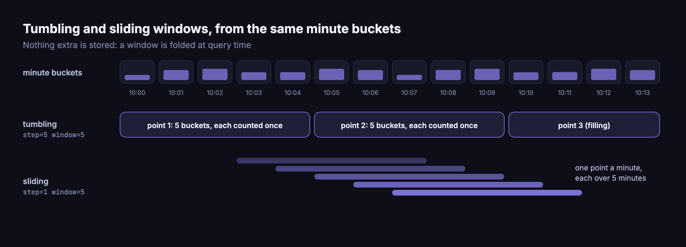
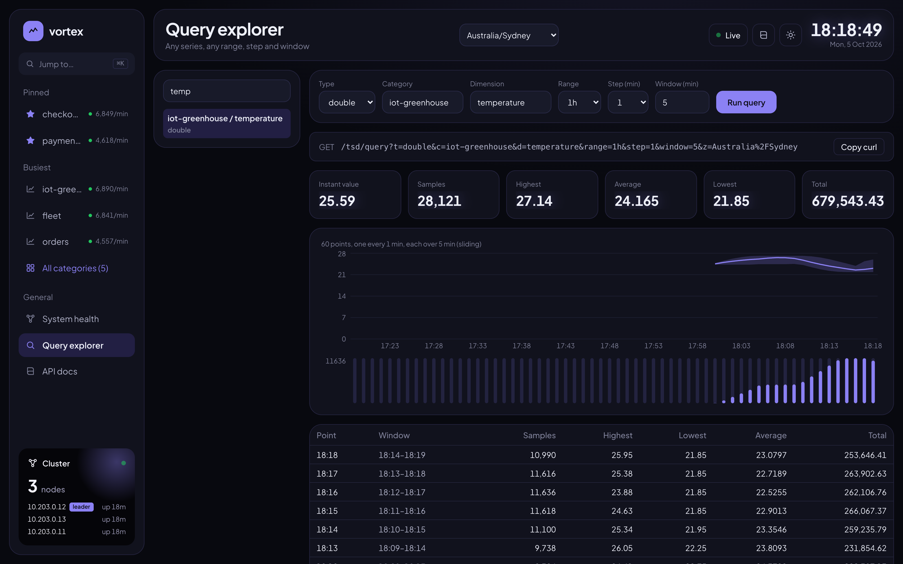
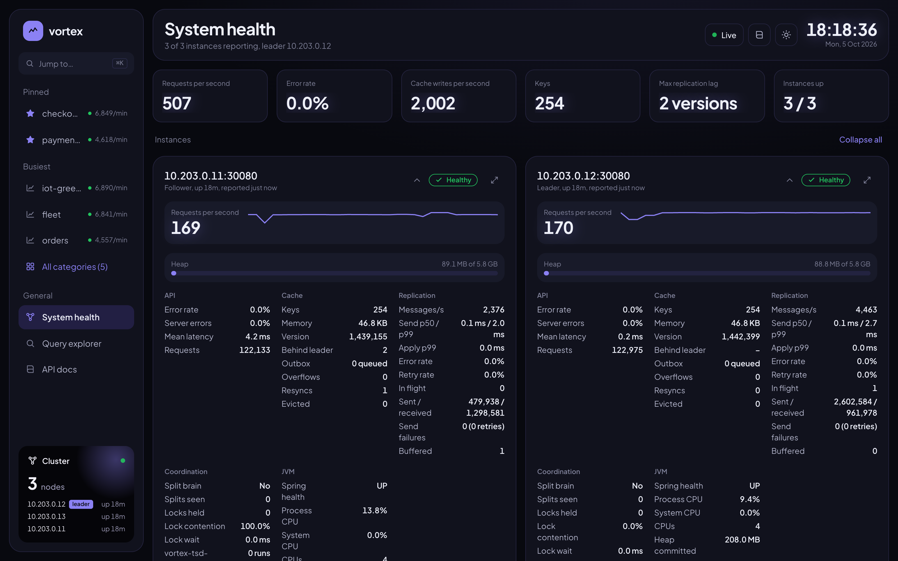
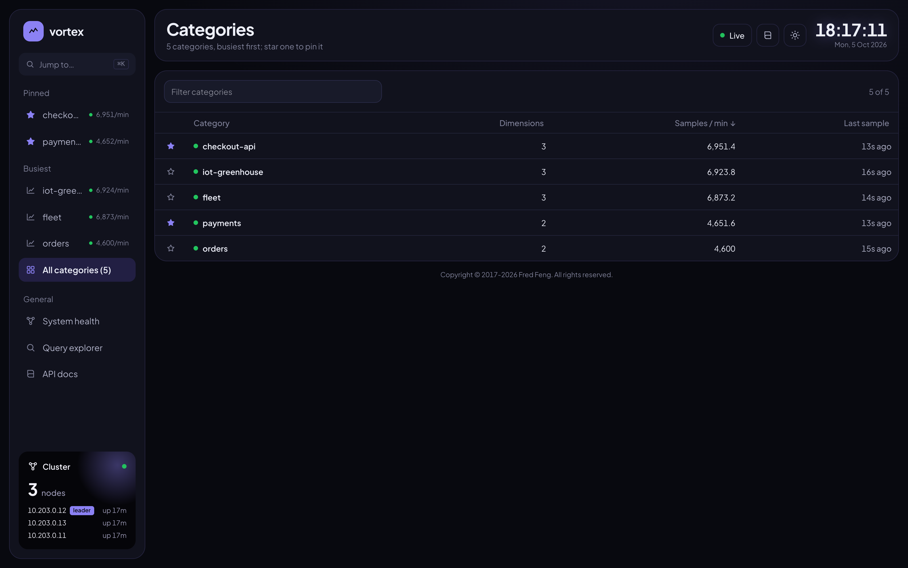
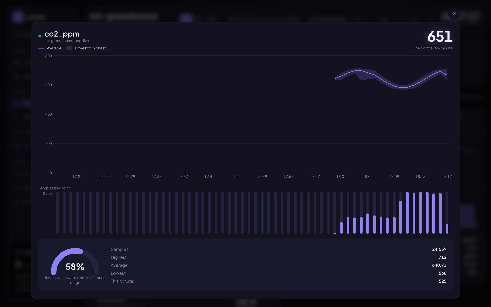
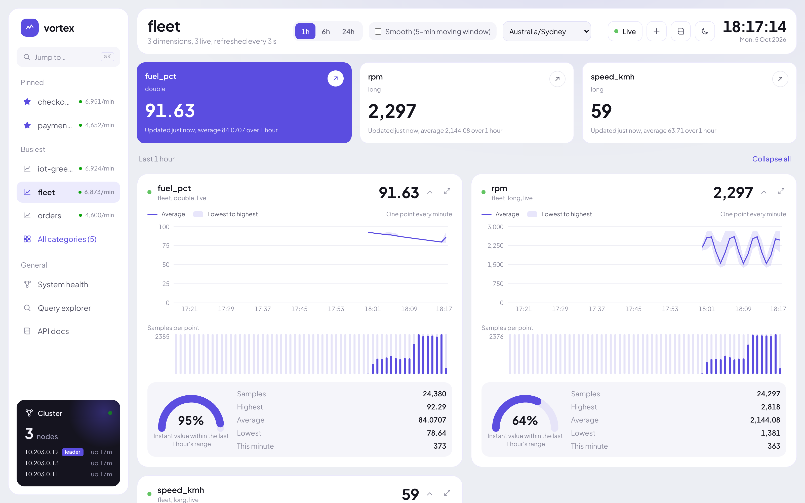

# Vortex TSDB

**Lightweight. Replicated. Real-time.**

A distributed time series database for live metrics: push numbers over HTTP, read per-minute
aggregates, instant values and tumbling or sliding windows. Every node holds the whole dataset in
memory; one command starts a cluster.

[](https://github.com/paganini2008/vortex)
[](https://hub.docker.com/r/fredfeng033/vortex-tsdb)
[](https://github.com/paganini2008?tab=packages&repo_name=vortex)
[](https://hub.docker.com/r/fredfeng033/vortex-tsdb/tags)
[](https://openjdk.org/)
[](https://spring.io/projects/spring-boot)
[](LICENSE)



**[Website](https://paganini2008.github.io/vortex/) · [Quick start](#quick-start) · [API](docs/api.md) · [Configuration](docs/configuration.md) · [Blog post](docs/blogger/vortex-tsdb.en.md)**

---

## Features

| | Feature | Problem it solves |
|---|---|---|
| ⚡ | **HTTP in, aggregates out** | Push `t/c/d/v`; read count · max · min · sum · avg per minute. No client library, no query language |
| 🪟 | **Tumbling & sliding windows** | Any `range` / `step` / `window`, folded from minute buckets at read time; nothing extra stored |
| 🎯 | **Exact under concurrency** | Every write is applied on the leader one at a time, then replicated: counts never drift, no locks |
| 🧬 | **Full replica on every node** | Reads are served from local memory on whichever node answers |
| 🛟 | **Self-healing cluster** | Nodes find each other and elect a leader; a new one within ~5 s after a crash |
| 💾 | **Survives restarts** | Snapshot at stop and every 5 min; the leader reloads, the others copy |
| 📦 | **Bounded memory** | 10,000 keys per node by default; the overflow moves to Redis if you have one |
| 🚪 | **One entry point** | Traefik on `:9080` serves the API, Swagger UI and the web console, healthy nodes only |
| 📊 | **Web console included** | Live boards, query explorer, cluster health (QPS, replication, JVM) |
| 🐳 | **Ready-made images** | Docker Hub and GHCR, `linux/amd64` + `linux/arm64` |

## How It Works







| Data | Key | Structure |
|---|---|---|
| Minute bucket | `tsd:<type>:<category>:<dimension>:<minute>` | STATS aggregate (max, min, sum, count); retention as TTL |
| Latest value | `tsd:last:<category>` | Hash: a whole category in one read |
| Series catalog | `tsd:catalog` | Sorted set by last sample; drives listings, pruned every minute |
| Cluster health | `tsd:health` | Hash; each node writes its figures every 5 s |

Built on the [openspreader](https://github.com/chaconne-ai/openspreader) replicated cache.

## Requirements

| To | You need | Version |
|---|---|---|
| Run the images (recommended) | Docker with compose v2 | Docker Desktop / Rancher Desktop / OrbStack, or Engine 23+ |
| Overflow store (optional) | Redis | tested with 7.4 and 8.6 |
| Build from source | JDK · Maven · Node.js | 17+ (images use 21) · 3.9 · 20+ |
| Free on the host | Ports `9080`, `9081`; subnet `10.203.0.0/24` | changeable, see [Configuration](#configuration) |

## Quick Start

> **Now on Docker Hub and GHCR, free to pull.** `latest` always carries the newest build.

**1. Start** (3 nodes + web console + gateway; nothing to build):

```bash
curl -fsSLO https://raw.githubusercontent.com/paganini2008/vortex/main/deploy/docker-compose.yml
docker compose up -d
```

**2. Write and read:**

```bash
curl -X POST 'http://localhost:9080/tsd/push?t=long&c=car&d=speed&v=44'
curl 'http://localhost:9080/tsd/last?t=long&c=car&d=speed'
```

**3. Expected output:**

```json
{"code":1,"data":{"value":44,"timestamp":1791182928819},"elapsed":1,"msg":"ok","requestPath":"/tsd/last"}
```

| Open | URL |
|---|---|
| Web console | http://localhost:9080/ |
| Swagger UI | http://localhost:9080/swagger-ui.html |
| Traefik dashboard | http://localhost:9081/dashboard/ |

| Other ways | Command |
|---|---|
| Pull only | `docker pull fredfeng033/vortex-tsdb:latest` · `docker pull fredfeng033/vortex-tsdb-web:latest` |
| From GHCR | `docker pull ghcr.io/paganini2008/vortex-tsdb:latest` · or `VORTEX_REGISTRY=ghcr.io/paganini2008 docker compose up -d` |
| Single node | `docker run -d -p 30080:30080 -v vortex-data:/data fredfeng033/vortex-tsdb` |
| From source | `git clone https://github.com/paganini2008/vortex.git && cd vortex && ./run-docker.sh` |
| Stop | `docker compose down` (keeps data) · `docker compose down -v` (deletes it) |

> Nodes take 20-30 s to start. Until `docker compose ps` shows them `(healthy)`, `/tsd` answers
> through the console and Swagger UI returns 404.

## Examples

Every response is `{"code": 1, "msg": "ok", "data": …}`; `code` is `0` on failure, with the reason in `msg`.

### 1. Push and read back (legacy-compatible API)

| Input | Output |
|---|---|
| `for v in 44 67 112; do curl -X POST "localhost:9080/tsd/push?t=long&c=car&d=speed&v=$v"; done` | three samples in this minute's bucket |
| `curl 'localhost:9080/tsd/last?t=long&c=car&d=speed'` | `{"value": 112, "timestamp": …}` |
| `curl 'localhost:9080/tsd/retrieve?t=long&c=car&d=speed&z=Asia/Shanghai'` | 60 buckets keyed `HH:mm:ss`, e.g. `"09:29:00": {"count": 3, "highestValue": 112, "lowestValue": 44, "totalValue": 223, "averageValue": 74.3333}` |

### 2. Window queries

```bash
curl 'localhost:9080/tsd/query?t=long&c=car&d=speed&range=6h&step=5&window=15&z=Asia/Shanghai'
```

| Parameters | Result |
|---|---|
| `range=6h step=5 window=15` | 72 points, each over the 15 minutes before it (**sliding**) |
| `range=1h step=5` (window = step) | 12 points, each bucket counted once (**tumbling**) |
| `range=1d` (no step) | about 60 points, step chosen for you |
| always included | `last` (instant value), `current` (bucket filling now), `summary` (whole range) |

```json
{"range": "6h", "step": 5, "window": 15,
 "last": {"value": 61}, "summary": {"count": 21540, "highestValue": 140, "averageValue": 70.02},
 "points": [{"from": 1791069300000, "to": 1791070200000, "count": 900, "highestValue": 131, "averageValue": 69.8}]}
```



### 3. Categories, catalog and cluster

| Input | Output |
|---|---|
| `curl 'localhost:9080/tsd/category?c=car&range=1h'` | `/tsd/query` for every series of `car` |
| `curl 'localhost:9080/tsd/categories'` | `[{"category": "car", "series": 4, "samplesPerMinute": 3600.0, "lastSeen": …}]`, busiest first |
| `curl 'localhost:9080/tsd/series'` | every series seen within the retention |
| `curl 'localhost:9080/tsd/health'` | per node: QPS, error rate, cache, replication lag, leader, JVM |



### 4. The web console

| Board | Categories | Zoom | Light theme |
|---|---|---|---|
|  |  |  |  |

### Best practices

| Do | Why |
|---|---|
| Keep `category` small and stable (a device kind, a service) and put metrics in `dimension` | A board shows one category; `/tsd/category` reads all of it at once |
| Use `long` for counters, `double` for gauges, `decimal` for money | `long` is exact to 2^53; `decimal` keeps 8 places |
| Pick `step` that divides an hour or a day | Points line up on the clock in the zone you query |
| Size `VORTEX_CACHE_MAX_KEYS` to your working set | One series at 1-minute buckets for 24 h is up to 1,440 keys; Redis reads are slower |
| Retry a failed write only if a duplicate is acceptable | A write that failed during a leader change may already be stored |

## Configuration

Settings are `VORTEX_*` variables: in the environment or in a `.env` beside `docker-compose.yml`.

| Variable | Default | Description |
|---|---|---|
| `VORTEX_RETENTION` | `24h` | How long data is kept |
| `VORTEX_SPAN_MINUTES` | `1` | Bucket width in minutes; must divide 60 |
| `VORTEX_TIME_ZONE` | `UTC` | Zone when a request has no `z` |
| `VORTEX_CACHE_MAX_KEYS` | `10000` | Keys per node in memory |
| `VORTEX_REDIS_HOST` | blank | Overflow Redis; blank deletes keys beyond the limit. Also `_PORT`, `_PASSWORD`, `_DATABASE`, `_KEY_PREFIX` |
| `VORTEX_SNAPSHOT_INTERVAL` | `5m` | Snapshot interval; `0` for shutdown only |
| `VORTEX_GATEWAY_PORT` / `VORTEX_DASHBOARD_PORT` | `9080` / `9081` | Host ports |
| `VORTEX_REGISTRY` / `VORTEX_TAG` | `fredfeng033` / `latest` | Which images compose pulls |
| `VORTEX_SUBNET_PREFIX` | `10.203.0` | The nodes' subnet |
| `VORTEX_CONTAINER_PREFIX` | `vortex` | Container and network names |

Every setting, with `run-docker.sh` and the web console's: **[docs/configuration.md](docs/configuration.md)**.

## Performance

| Scenario | Result |
|---|---|
| 826,781 writes at rising rates | **0 failures**, identical totals on all 3 nodes |
| Sustained write rate | **~1,000 samples/s** (≈ 6,800 cache operations/s on the leader) |
| Peak | **1,400–1,500 samples/s**, leader CPU ~230%, heap ≤ 310 MB |
| `kill -9` the leader at 600 samples/s | new leader in **4.7 s**; 0.28% of requests failed, all at the kill |
| Graceful stop of the leader | immediate hand-over, no failed request |
| Restart of the whole cluster | data back from the snapshots |

Docker Desktop, 4 CPUs / 8 GB, 3 nodes, k6 through the gateway. Reproduce with [`test/loadtest.sh`](docs/development.md#load-test).

|  | Vortex TSDB | Prometheus | InfluxDB | TimescaleDB |
|---|---|---|---|---|
| Writes | HTTP push | periodic pull | HTTP push | SQL |
| Queries | HTTP parameters | PromQL | InfluxQL / SQL | SQL |
| Storage | in-memory replicas + snapshots | local disk | disk | PostgreSQL |
| High availability | built in | extra setup | by edition | PostgreSQL tooling |
| Best for | live metrics, days of retention | monitoring & alerting | general time series | long-term analytics |

| Trade-off | Consequence |
|---|---|
| Writes go through one leader | Throughput does not grow with nodes |
| Data lives in memory | Killing every node at once loses up to one snapshot interval |
| Asynchronous replication | Writes in flight when the leader crashes fail or are lost |
| No query language, alerting or auth | Put it behind your own network controls |

## Documentation

| Guide | Contents |
|---|---|
| [API reference](docs/api.md) | Every endpoint, parameter and response · Swagger UI at `/swagger-ui.html` |
| [Configuration](docs/configuration.md) | Every `VORTEX_*` setting: compose, nodes, `run-docker.sh`, web console |
| [Development & tests](docs/development.md) | Run from source, unit tests, `test/functest.sh`, `test/loadtest.sh` |
| [FAQ & troubleshooting](docs/faq.md) | Ports, subnets, Redis, Swagger 404 at start-up, failover, data loss |
| [Blog post](docs/blogger/vortex-tsdb.en.md) · [中文](docs/blogger/vortex-tsdb.zh.md) | The design, end to end |

## Contributing & License

| | |
|---|---|
| Report a bug or ask for a feature | [Issues](https://github.com/paganini2008/vortex/issues) |
| Send a change | Fork → branch → `mvn verify` and `npm run coverage` (80% gates) → [pull request](https://github.com/paganini2008/vortex/pulls) |
| Layout | `backend/tsdb-service` (Spring Boot) · `frontend/tsdb-web` (Next.js) · `deploy/` (compose) · `test/` · `run-docker.sh` |
| License | [Apache License 2.0](LICENSE) |
